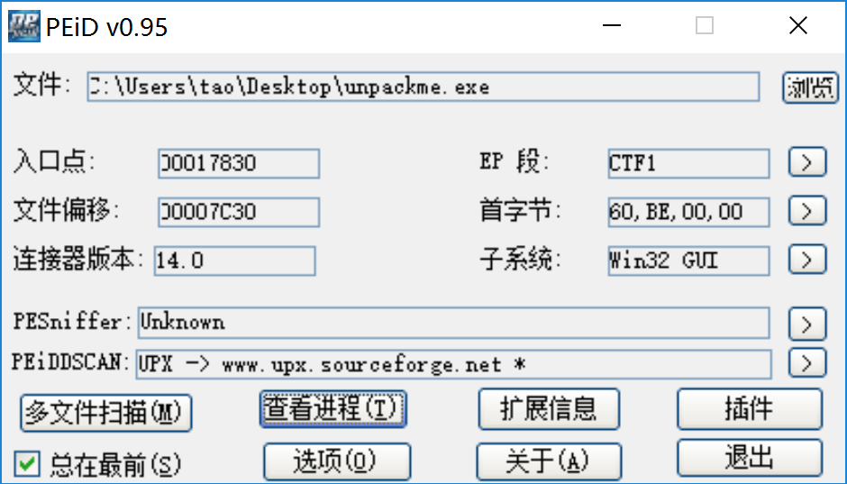
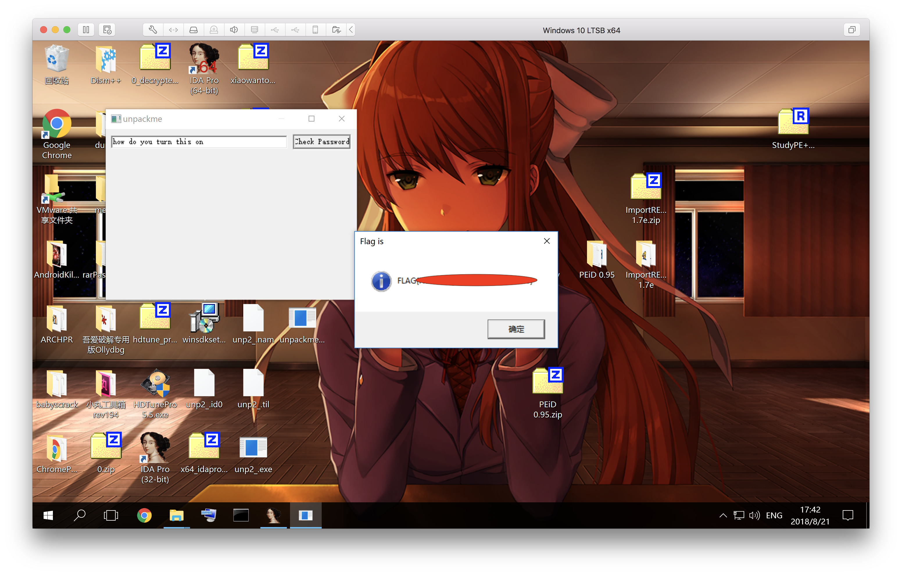

# Reversing

IDA is our friend.

## 36: helloworld

32 位 ELF 程序。F5 大法得到：

```c
int __cdecl main(int argc, const char **argv, const char **envp)
{
  char flag[29]; // [esp+Bh] [ebp-2Dh]
  int n; // [esp+28h] [ebp-10h]
  int i; // [esp+2Ch] [ebp-Ch]

  *(_DWORD *)flag = -931010319;
  *(_DWORD *)&flag[4] = -825261614;
  *(_DWORD *)&flag[8] = -2118090283;
  *(_DWORD *)&flag[12] = -925515565;
  *(_DWORD *)&flag[16] = -843001906;
  *(_DWORD *)&flag[20] = -858468479;
  *(_DWORD *)&flag[24] = -1881946941;
  flag[28] = 0;
  printf("What is magic number? ");
  __isoc99_scanf("%d", &n);
  if ( n == 314159265 )
  {
    for ( i = 0; flag[i]; ++i )
      flag[i] ^= n;
    printf("Flag is FLAG{%s}\n", flag);
  }
  else
  {
    puts("Try Hard.");
  }
  return 0;
}
```

在 Linux 下启动程序，输入 314159265 即可。

## 37: simple

```c
int __cdecl main(int argc, const char **argv, const char **envp)
{
  char checking[64]; // [esp+Ch] [ebp-8Ch]
  char buffer[64]; // [esp+4Ch] [ebp-4Ch]
  int i; // [esp+8Ch] [ebp-Ch]

  printf("What is flag? ");
  fgets(buffer, 63, stdin);
  for ( i = 0; buffer[i]; ++i )
  {
    if ( buffer[i] == 10 )
    {
      buffer[i] = 0;
      checking[i] = 0;
    }
    else
    {
      checking[i] = buffer[i] + 1;
    }
  }
  if ( !strcmp(checking, "UIJT.JT.ZPVS.GMBH") )
    printf("FLAG{%s}\n", buffer);
  else
    puts("Try hard.");
  return 0;
}
```

现在要让 `checking` 与 `"UIJT.JT.ZPVS.GMBH"` 相等，而显然，`buffer` 除了 `\0` 以外的字符就 `= checking[i] - 1`。

所以：

```python
for i in "UIJT.JT.ZPVS.GMBH":
    print(chr(ord(i)-1),end='')
```

就可以跑出结果。

## 38: pyyy

这次是一个 `pyc` 文件。使用 `file` 可知为 Python 2.7 字节码文件。使用 `uncompyle2` 反编译。

```python
__import__('sys').setrecursionlimit(1048576)
data = 'Tt1PJbKTTP+nCqHvVwojv9K8AmPWx1q1UCC7yAxMRIpddAlH+oIHgTET7KHS1SIZshfo2DOu8dUt6wORBvNVBpUSsuHa0S78KG+SCQtB2lr4c1RPbMf0nR9SeSm1ptEY37y310SJMY28u6m4Y44qniGTi39ToHRTyxwsbHVuEjf480eeYAfSVvpWvS8Oy2bjvy0QMVEMSkyJ9p1QlGgyg3mUnNCpSb96VgCaUe4aFu4YbOnOV3HUgYcgXs7IcCELyUeUci7mN8HSvNc93sST6mKl5SDryngxuURkmqLB3azioL6MLWZTg69j6dflQIhr8RvOLNwRURYRKa1g7CKkmhN4RytXn4nyK2UM/SoR+ntja1scBJTUo0I31x1wBJpT4HjDN47FLQWIkRW+2wnB3eEwO5+uSiQpzA8VaH7VGRrlU/BFW4GqbaepzKPLdXQFBkNyBKzqzR/zA2GIrYbLIVScWJ19DqJCOyVLGeVIVXyzN1y327orYL2Ee3lRITnE3FouicRStaznIcw8xmxvukwVMRZIJ/vTu8Zc1WQIYEIFXMHozGuvzZgROZTyFihWNRCBBtoP9DJJALJb0pA1IKIb2zLh+pwGF40Y6y93D6weKejGPO+A0DBXH9vuLcCcCIvr/XPQhO3jLKCBN+h9unuJKW3dyWxyaVPdR2V+BTw10VXolo7yaTH1GbR4TiVSB308mBOMwfchwihEe7RdMXvmXgaGarKkJe0NLUCd8jwhYII+WymjxO/xOz/ppOvNfAyIQksW0sggRPQTlgXSZ7MIVA1h66sGNljJ833MoFzWof3azLabaz1OrAJFqYXBg/myDsy1tV6rULSQ82hVR/TNnSmBGvyEDJTrLSwHyj78NOrW4mUnlLGBnAgWfw6pW2lRK2jkNX9NM6DfLsRK8lwl85UP8CZSuNdcLmLwHTVMZGm/cNkZCtWRBlZqEggxGdIO44D+f4y6ysnAk5/QzEwjIuecxEOb0jyV6dFui8g0c3Oxlhzcli0X8ToJFyeQRv1N9nokYZ07tFlG6m18kCToKz1qiH1U7kljXa6SvdORur5dWYLQ//gwhwppe7JlNda/cEoh92h96wRZDv1dSK/f1vz+mUeUyUlFY0iMjfw5eBXWZppNZi3ZtJcq5kllM2ACVFcxQWI3azM3ArOcqjosoiPjNoDYgKh7w4k2Cd0kLYEHscz/njtJ1KEcwLtqs4nJ+gB2r4V9g03YgvY5E8JJtfJMKdaTedjtvEuif8FNlCK9DMnL1iLpWptJbdfO83Y7Y46XCqjZFBI5o9Qtb78nLhMEM5/YTaNOM/wE/oJl5HI/i1X6kW3PKCsVubRkOkc2xawl6NYdLETjLvmrGhhI'
a = 138429774382724799266162638867586769792748493609302140496533867008095173455879947894779596310639574974753192434052788523153034589364467968354251594963074151184337695885797721664543377136576728391441971163150867881230659356864392306243566560400813331657921013491282868612767612765572674016169587707802180184907L
b = 166973306488837616386657525560867472072892600582336170876582087259745204609621953127155704341986656998388476384268944991674622137321564169015892277394676111821625785660520124854949115848029992901570017003426516060587542151508457828993393269285811192061921777841414081024007246548176106270807755753959299347499L
c = 139406975904616010993781070968929386959137770161716276206009304788138064464003872600873092175794194742278065731836036319691820923110824297438873852431436552084682500678960815829913952504299121961851611486307770895268480972697776808108762998982519628673363727353417882436601914441385329576073198101416778820619L
d = 120247815040203971878156401336064195859617475109255488973983177090503841094270099798091750950310387020985631462241773194856928204176366565203099326711551950860726971729471331094591029476222036323301387584932169743858328653144427714133805588252752063520123349229781762269259290641902996030408389845608487018053L
e = 104267926052681232399022097693567945566792104266393042997592419084595590842792587289837162127972340402399483206179123720857893336658554734721858861632513815134558092263747423069663471743032485002524258053046479965386191422139115548526476836214275044776929064607168983831792995196973781849976905066967868513707L
F = (a,
 b,
 c,
 d,
 e)
m = 8804961678093749244362737710317041066205860704668932527558424153061050650933657852195829452594083176433024286784373401822915616916582813941258471733233011L
g = 67051725181167609293818569777421162357707866659797065037224862389521658445401L
z = []
for i, f in enumerate(F):
    n = pow(f, m, g)
    this_is = 'Y-Combinator'
    l = (lambda f: (lambda x: x(x))(lambda y: f(lambda *args: y(y)(*args))))(lambda f: lambda x: (1 if x < 2 else f(x - 1) * x % n))(g % 27777)
    c = raw_input('Channenge #%d:' % i)
    if int(c) != l:
        print 'Wrong~'
        exit()
    z.append(l)

z.sort()
gg = '(flaSg\'7 \\h#GiQwt~66\x0csxCN]4sT{? Zx YCf6S>|~`\x0c$/}\'\r:4DjJFvm]([sP%FMY"@=YS;CQ7T#zx42#$S_j0\\Lu^N31=r\x0b\t\tjVhhb_KM$|6]\nl!:V\rx8P[0m ;ho_\rR(0/~9HgE8!ec*AsGd[e|2&h!}GLGt\'=$\x0cbKFMnbez-q\\`I~];@$y#bj9K0xmI2#8 sl^gBNL@fUL\x0b\\9Ohf]c>Vj/>rnWXgLP#<+4$BG@,\'n a_7C:-}f(WO8Y\x0c2|(nTP!\'\\>^\'}-7+AwBV!w7KUq4Qpg\tf.}Z7_!m+ypy=`3#\\=?9B4=?^}&\'~ Z@OH8\n0=6\x0b\tv\nl!G\'y4dQW5!~g~I*f"rz1{qQH{G9\x0c\'b\x0cp\x0bdu!2/\\@i4eG"If0A{-)N=6GMC<U5/ds\rG&z>P1\nsq=5>dFZUWtjv\tX~^?9?Irwx\\5A!32N\x0bcVkx!f)sVY Men\x0c\'ujN<"LJ\x0c5R4"\\\\XPVA\'m$~tj)Br}C}&kX2<|\np3XtaHB.P\'(E 4$dm!uDyC%u ["x[VYw=1aDJ (8V/a!J?`_r:n7J88!a25AZ]#,ab?{%e\x0b]wN_}*Q:mh>@]u\t&6:Z*Fmr?U`cOHbAf7s@&5~L ,\tQ18 -Hg q2nz%\x0ccUm=dz&h1(ozoZ)mrA=`HKo\n\'rXm}Z-l3]WgN\\NW<{o=)[V({7<N1.-A8S"=;3sderb\tOZ$K\r0o/5\x0bMc76EGCWJ3IQpr7!QhbgzX8uGe3<w-g\'/j\'\tM4|9l?i&tm_\n57X0B2rOpuB@H@%L_\r)&/q=LZa(%}""#if#Kq74xK?`jGFOn"8&^3Q-\r#]E$=!b^In0:$4VKPXP0UK=IK)Y\rstOT40=?DyHor8j7O\\r/~ncJ5];cCT)c?OS0EM5m#V(-%"Tu:!UsE],0Dp  s@HErS]J{%oH54B&(zE.(@5#2k\tJnNlnUEij\\.q/3HBpJNk*X(k5;DlqK\'\'fX\r}EBk_7\x0b:>8~\t+M@WJx.PO({/U}1}#TqjreG\nN{\rX>4EsJr0Pn\\Z\\aL/-U<<{,Q;j\tF=7f\')+wH:p{G=_.s\\t-\x0bI\x0c*y\t1P:Y|/2xE<uo]~$>5k]FW+>fR<QA"(Fj[LL(hzfQo#PJ;:*0kB~3]9uL[o.xue:VQ\t;9-Tu\tq|mzzhV_okP\t,d\rQ`]5Gf\x0c#gXB\x0cAH|)NI|K=KW-&p-<b"3e.rO\x0cuK=\x0c^\r+MuLxCJ`UKaD\x0bBH&n+YVajZ(U7pwWtto3T10VLHwSJ\rK\t}\'F$l1:b2Bd\na=#t0iq}#!{1_)w$}<Dp(borC\'\t?r6;,+k;a(Q3@B?RCWYEDrjZe![x=n_%S]rl{&fLr*mgCD;92/nNsaxKy/;\nr]sPK=`+YP>MmfB\n8O4/"}nE7r*=41f2\t37>K\'s$wpl;qS[`qzu\x0b\t\nuaU|b,C`4& dRN~]7DnuTb2FhNHV!#Z2Hho\x0b[%.{O\t$q0\x0ch_@?w@b8[I^{JL|O8]i8{p)A.w)14qK3JoyF%licZ~ga\rW[L:W\rtIvfWJjZUOvB\rS.Beav3!-@bw|PexJ Pcw1\ry6!63B}]J])6fak/3r]W\tMeXt[uc(1_U lys{a1X\r%)[wwP3rhgNW{*d~_E%Q2htCt5ha@l0^0=\x0bwT\ni4/V;_\nM1rb?w~Q)Dli4u\n`}1+D8"\t`@V~$9l$Uy**VnI (@Ga0<RxfmoNgJTtE-aLH\rE5fMy7rk$)V\rL2Fv/AivOa"\nuX|70Xrw^D]%i%JyT\x0cc%cwZ/Wbp=IiY;/@nFEe>3=tM;K*`fReGoc5V/Ri?nXZ-RW)\'\t<\x0cV>@X@-Ei4%sO%},B_pjc`s"@oKCmdgDhjUZT@?mb\'?Q:F\x0bLJkPgjaFAc=rbrjAz$Zz\x0cq0GU!")xFOEF(x!3M\t:l83|}}HgGJJ#eT/I\x0b[|lK_n+;Wi/N^B4LzL.a(gVWq,zO6\'S|tb>RX` ca*CO<w\x0ci =wc1,M~\x0bc`FYEs\r){+Ll8[I9-88m\t\\iK/\\hno-C[vX*3Hx:%:K\rt\x0cW!tj\'SOhqxP|k7cw Hm?I@?P\'HmapG7$0#T(Auz]sjmd#\rFP/}53@-Kvmi(d%dZKLZ2LK\'e_E\x0bQmR 5/(irq4-EUyp<hB?[\tnU:p*xuzASM'
print ''.join((gg[(lambda f: (lambda x: x(x))(lambda y: f(lambda *args: y(y)(*args))))(lambda f: lambda n: (1 if n < 3 else f(n - 1) + f(n - 2)))(i + 2)] for i in range(16))) % ''.join((data[pow((__import__('fractions').gcd(z[i % 5], z[(i + 1) % 5]) * 2 + 1) * g, F[i % 5] * (i * 2 + 1), len(data))] for i in range(32)))
```

似乎被混淆了。但我们的最终目的是获得 flag，而不是解「Channenge」。删除第 20 到 23 行，运行，报错。

```shell
[1]    10890 segmentation fault  python pyyy_sol.py
```

注释掉第一行再运行，发现第 19 行一直在递归。发生了什么？注意到有一行似乎没有用：

```python
this_is = 'Y-Combinator'
```

`Y-Combinator` 是什么？难道指的是某家创投孵化器？Google 搜索 `Y-Combinator python`，可以找到正确的、相关的解释，这里复制一段。


>In strict functional programming and the lambda calculus, functions (lambda expressions) don't have state and are only allowed to refer to arguments of enclosing functions. This rules out the usual definition of a recursive function wherein a function is associated with the state of a variable and this variable's state is used in the body of the function.
>
>The Y combinator is itself a stateless function that, when applied to another stateless function, returns a recursive version of the function. The Y combinator is the simplest of the class of such functions, called fixed-point combinators.

（From: [https://rosettacode.org/wiki/Y_combinator](https://rosettacode.org/wiki/Y_combinator)）

由下面 Python 的代码样例可以知道：

`(lambda f: (lambda x: x(x))(lambda y: f(lambda *args: y(y)(*args))))` 就是 Y-Combinator。`(lambda f: lambda x: (1 if x < 2 else f(x - 1) * x % n))` 是第二个函数，`(g % 27777)` 是参数。即 $Y(f)(g\mod27777)$ 。

但是尝试照着样例来修改了之后还是 segfault。最后发现是自己装的 python2 的问题，换 Mac 自带的就行了。

坑啊。

## 39: accumulator

```c
signed __int64 __fastcall main(__int64 a1, char **a2, char **a3)
{
  __int64 v3; // rbx
  char v4; // al
  signed __int64 result; // rax
  __int64 v6; // [rsp+0h] [rbp-458h]
  char v7; // [rsp+3Fh] [rbp-419h]
  char v8; // [rsp+40h] [rbp-418h]
  unsigned __int64 v9; // [rsp+448h] [rbp-10h]

  v3 = 0LL;
  v9 = __readfsqword(0x28u);
  __printf_chk(1LL, "What's your flag? ", a3);
  do
  {
    v4 = _IO_getc(stdin);
    if ( v4 == 10 )
      break;
    if ( v4 == -1 )
      break;
    *(&v7 + ++v3) = v4;
  }
  while ( v3 != 1024 );
  if ( SHA512(&v8, v3, &v6) )
  {
    sub_4008C0(&v6, 64LL);
    sub_4008C0(&v8, v3);
    puts("Good flag for you.");
    result = 0LL;
  }
  else
  {
    puts("error");
    result = 1LL;
  }
  return result;
}
```

程序首先读入，以 `EOF` 或换行结束，在 SHA512 后给 `sub_4008C0()` 检查 flag 与 sha512 后的 flag。

```c
void __fastcall sub_4008C0(unsigned __int8 *a1, __int64 a2)
{
  int v2; // edx
  bool v3; // zf
  __int64 v4; // rcx
  unsigned __int8 *v5; // rax
  unsigned __int8 *v6; // rsi
  int v7; // er8

  if ( a2 )
  {
    v2 = dword_6013C0 + *a1;
    v3 = v2 == dword_601080[dword_6013B0];
    v4 = (unsigned int)(dword_6013B0 + 1);
    dword_6013C0 += *a1;
    ++dword_6013B0;
    if ( !v3 )
    {
LABEL_8:
      puts("Bad flag :(");
      exit(1);
    }
    v5 = a1 + 1;
    v6 = &a1[a2];
    while ( v5 != v6 )
    {
      v7 = *v5++;
      v2 += v7;
      v3 = v2 == dword_601080[v4];
      dword_6013C0 = v2;
      dword_6013B0 = v4 + 1;
      if ( !v3 )
        goto LABEL_8;
      v4 = (unsigned int)(v4 + 1);
    }
  }
}
```

代码很乱。我们先整理一下。可以导出 `dword_601080[]` 的数据（使用 `Alt + L` 与 `Shift + E`）。

并且知道全局变量 `dword_6013B0` 初始为 0x20，`dword_6013C0` 初始为 0x08。

分析后可以粗略看出逻辑是将参数数组的前缀和逐位与 `dword_601080[]` 比较，因此尝试：

```python
inside_array = [195, 255, 493, 584, 799, 929, 946, 1086, 1180, 1184, 1421, 1595, 1805, 1846, 2081, 2320, 2430, 2605, 2727, 2972, 3213, 3403, 3418, 3649, 3712, 3950, 3989, 4193, 4228, 4394, 4523, 4624, 4706, 4935, 4999, 5072, 5106, 5291, 5510, 5536, 5644, 5751, 5993, 6118, 6126, 6198, 6211, 6410, 6469, 6609, 6647, 6752, 6978, 7010, 7053, 7106, 7274, 7468, 7563, 7673, 7706, 7956, 8146, 8187, 8257, 8333, 8398, 8469, 8592, 8640, 8693, 8742, 8793, 8844, 8901, 8953, 9007, 9062, 9113, 9161, 9215, 9317, 9374, 9429, 9483, 9540, 9591, 9644, 9692, 9741, 9792, 9846, 9944, 9996, 10045, 10144, 10195, 10246, 10294, 10350, 10402, 10450, 10551, 10652, 10750, 10849, 10946, 11045, 11096, 11147, 11202, 11304, 11353, 11451, 11507, 11605, 11653, 11753, 11852, 11900, 11951, 12052, 12105, 12161, 12259, 12360, 12409, 12461, 12563, 12664, 12718, 12775, 12823, 12921, 12970, 13020, 13071, 13173, 13227, 13276, 13374, 13422, 13521, 13569, 13667, 13718, 13771, 13873, 13972, 14029, 14080, 14179, 14278, 14377, 14432, 14482, 14531, 14579, 14627, 14679, 14732, 14789, 14840, 14894, 14951, 15052, 15154, 15210, 15263, 15314, 15363, 15460, 15509, 15610, 15666, 15763, 15818, 15916, 15968, 16018, 16075, 16132, 16233, 16288, 16386, 16443, 16543, 16600, 16655, 16703, 16801, 16858, 16955, 17005, 17056, 17153, 17250, 17375
]

for i in range(1, len(inside_array)):
	print(chr(inside_array[i] - inside_array[i - 1]), end='')
```

就得到了 flag（一开始是一些乱码，可以忽略）。

## 40: GCCC

`file` 检查发现是 .Net 字节码。使用 `dnSpy` 反编译得到如下：

```c#
using System;

// Token: 0x02000002 RID: 2
public class GrayCCC
{
	// Token: 0x06000002 RID: 2 RVA: 0x00002058 File Offset: 0x00000458
	public static void Main()
	{
		Console.Write("Input the key: ");
		uint num;
		if (!uint.TryParse(Console.ReadLine().Trim(), out num))
		{
			Console.WriteLine("Invalid key");
			return;
		}
		string text = "";
		string text2 = "ABCDEFGHIJKLMNOPQRSTUVWXYZ{} ";
		int num2 = 0;
		byte[] array = new byte[]
		{
			164,
			25,
			4,
			130,
			126,
			158,
			91,
			199,
			173,
			252,
			239,
			143,
			150,
			251,
			126,
			39,
			104,
			104,
			146,
			208,
			249,
			9,
			219,
			208,
			101,
			182,
			62,
			92,
			6,
			27,
			5,
			46
		};
		byte b = 0;
		while (num != 0u)
		{
			char c = (char)(array[num2] ^ (byte)num ^ b);
			if (!text2.Contains(new string(c, 1)))
			{
				Console.WriteLine("Invalid key");
				return;
			}
			text += c;
			b ^= array[num2++];
			num >>= 1;
		}
		if (text.Substring(0, 5) != "FLAG{" || text.Substring(31, 1) != "}")
		{
			Console.WriteLine("Invalid key");
			return;
		}
		Console.WriteLine("Your flag is: " + text);
	}
}

```

可知，程序对输入的 `num` 进行校验，结果要求开头为 `"FLAG{"`，结尾为 `"}"`，中间的字符出现在 `text2` 中。根据提示，我们试一下 `z3`。`z3` 是来自 Microsoft Research 的开源定理证明器。

最终代码如下：

```python
from z3 import *

s = Solver()

num = BitVec('num', 32)
num2 = 0
array = [164, 25, 4, 130, 126, 158, 91, 199, 173, 252, 239, 143, 150, 251, 126, 39, 104, 104, 146, 208, 249, 9, 219, 208, 101, 182, 62, 92, 6, 27, 5, 46]
b = 0

begin = "FLAG{"
end = "}"

for i in xrange(32):
    c = (array[num2] ^ (num & 0xFF) ^ b)
    if i < len(begin):
        s.add(c == ord(begin[i]))
    elif i == 31:
        s.add(c == ord('}'))
    else:
        s.add(Or(And(c >= ord('A'), c <= ord('Z')), c == ord(' ')))
    b ^= array[num2]
    num2 += 1
    # num >>= 1
    num = LShR(num, 1)

print s.check()
if s.check() == sat:
    print s.model()
```

注意 `num` 为 `uint`，所以向右移位使用 `LShR`（逻辑移位）。

解得 `num` 为 3658134498。启动程序，输入，获得 flag。

## 41: ccc

```c
int __cdecl main(int argc, const char **argv, const char **envp)
{
  ssize_t v3; // ST18_4
  char buf; // [esp+Ch] [ebp-4Ch]
  unsigned int v6; // [esp+4Ch] [ebp-Ch]

  v6 = __readgsdword(0x14u);
  v3 = read(0, &buf, 0x40u);
  if ( verify((int)&buf, v3 - 1) )
    write(1, "Good\n", 5u);
  else
    write(1, "QQ\n", 3u);
  return 0;
}
```

检查 `verify()`。

```c
signed int __cdecl verify(int a1, int a2)
{
  int v3; // ecx
  int v4; // eax
  int i; // [esp+8h] [ebp-8h]
  int v6; // [esp+Ch] [ebp-4h]

  v6 = 0;
  if ( a2 != 42 )
    return 0;
  for ( i = 3; i <= 42; i += 3 )
  {
    v3 = crc32(0, (_BYTE *)a1, i);
    v4 = v6++;
    if ( v3 != hashes[v4] )
      return 0;
  }
  return 1;
}
```

可以看到，flag（`al`）有 42 个字节，`verify()` 分别取 `a1[]` 的前 3、6、9……个字节进行 `crc32`，然后与 `hashes[]` 比较。

尝试写 `z3`，但是怎么写都写不对，最后就尝试枚举吧。

```python
import string
from binascii import crc32

hashes = [3594606959, 2158225808, 3381484699, 218476463, 326279469, 1566511483, 1073871869, 2815612267, 2097478526, 776112478, 1640595123, 2225816515, 2680236509, 4099485517, 4294967295, 4294967295, 4294967295, 4294967295, 4294967295, 4294967295, 4294967295, 4294967295, 4294967295, 4294967295]
alphabet = string.printable

flag = ''

# for i in range(42/3):
i = 0
while i != 42/3:
    for a in alphabet:
        for b in alphabet:
            for c in alphabet:
                flag += a+b+c
                if crc32(flag) & 0xffffffff == hashes[i]:
                    i += 1
                    continue
                else:
                    flag = flag[:-3]

print flag
```

很暴力，但是有效。

## 42: bitx

```c
int __cdecl main(int argc, const char **argv, const char **envp)
{
  int result; // eax

  if ( argc > 1 )
  {
    if ( verify(argv[1]) )
      puts("Good");
    else
      puts("Not flag");
    result = 0;
  }
  else
  {
    printf("Usage: %s FLAG{This is not flag}\n", *argv);
    result = 0;
  }
  return result;
}
```

`verify()`:

```c
signed int __cdecl verify(int a1)
{
  int i; // [esp+Ch] [ebp-4h]

  for ( i = 0; *(_BYTE *)(i + a1) && *(_BYTE *)(i + 134520896); ++i )
  {
    if ( *(_BYTE *)(i + a1) + 9 != ((unsigned __int8)((*(_BYTE *)(i + 134520896) & 0xAA) >> 1) | (unsigned __int8)(2 * (*(_BYTE *)(i + 134520896) & 0x55))) )
      return 0;
  }
  return 1;
}
```

`134520896` 转换为十六进制为 `0x0804A040`，转到该地址，提取数据：

```c
unsigned char ida_chars[] =
{
  0x8F, 0xAA, 0x85, 0xA0, 0x48, 0xAC, 0x40, 0x95, 0xB6, 0x16, 
  0xBE, 0x40, 0xB4, 0x16, 0x97, 0xB1, 0xBE, 0xBC, 0x16, 0xB1, 
  0xBC, 0x16, 0x9D, 0x95, 0xBC, 0x41, 0x16, 0x36, 0x42, 0x95, 
  0x95, 0x16, 0x40, 0xB1, 0xBE, 0xB2, 0x16, 0x36, 0x42, 0x3D, 
  0x3D, 0x49, 0x00
};
```

Payload:

```python
ch = [  0x8F, 0xAA, 0x85, 0xA0, 0x48, 0xAC, 0x40, 0x95, 0xB6, 0x16, 
  0xBE, 0x40, 0xB4, 0x16, 0x97, 0xB1, 0xBE, 0xBC, 0x16, 0xB1, 
  0xBC, 0x16, 0x9D, 0x95, 0xBC, 0x41, 0x16, 0x36, 0x42, 0x95, 
  0x95, 0x16, 0x40, 0xB1, 0xBE, 0xB2, 0x16, 0x36, 0x42, 0x3D, 
  0x3D, 0x49, 0x00]

for i in range(len(ch)):
    print(chr((((ch[i] & 0xaa) >> 1) | (2 * (ch[i] & 0x55)))-9), end='')
```

输出 flag 后会报错，但是不用管。

## 43: 2018-rev

初步逆向结果非常诡异，找不到 `main()`。尝试直接运行。

```shell
2018.rev: 2018.c:67: main: Assertion `argc == 2018 && argv[0][0] == 1 && envp[0][0] == 1' failed.
已放弃
```

而要满足这个条件，我们只要手动调用 `execve()` 就行。

```c
#include <stdio.h>
#include <unistd.h>
#include <string.h>
#include <stdlib.h>

int main(void) {
	char *argv[2019] = {}; // include the terminating
	char *envp[2019] = {};
	for (int i = 0; i < 2018; i++) {
		argv[i] = malloc(5);
		envp[i] = malloc(5);
		strcpy(argv[i], "test");
		strcpy(envp[i], "test");
	}
	argv[0][0] = 1;
	envp[0][0] = 1; // dirty hack code for 2018.rev
	execve("./2018.rev", argv, envp);
	perror("execve: ");
	return 0;
}
```

然后：

```
Bad timing, you should open this at 2018/1/1 00:00:00 (UTC) :(
```

之后尝试使用 `libfaketime`，但是发现 `2018.rev` 是静态链接的，无法用这种方法伪造时间。最后还是写了两个脚本运行：

```sh
#!/bin/bash
while true
do
	date --utc --set="2018-01-01 00:00:00"
done
```

```sh
#!/bin/bash
while true
do
	./2018
done
```

作为虚拟机用户，时间的问题无需担心，反正会同步宿主机的时间。

## 44: what-the-hell

```c
int __cdecl main(int argc, const char **argv, const char **envp)
{
  int v4; // [esp+0h] [ebp-18h]
  unsigned int v5; // [esp+4h] [ebp-14h]
  int v6; // [esp+8h] [ebp-10h]
  unsigned int v7; // [esp+Ch] [ebp-Ch]

  v7 = __readgsdword(0x14u);
  printf("Input the key: ");
  __isoc99_scanf("%u-%u", &v4, &v5);
  v6 = calc_key3(v4, v5);
  if ( v6 )
    decrypt_flag(v4, v5, v6);
  else
    puts("Bad key, try again.");
  return 0;
}
```

看一下 `calc_key3()`:

```c
int __cdecl calc_key3(int a1, int a2)
{
  signed int i; // [esp+Ch] [ebp-Ch]

  if ( a2 * a1 != -574406350 )
    return 0;
  if ( (a1 ^ 0x7E) * (a2 + 16) != 1931514558 )
    return 0;
  if ( (((_WORD)a1 - (_WORD)a2) & 0xFFF) != 3295 )
    return 0;
  if ( !check_prime(a1) )
    return 0;
  for ( i = 1; i <= 9999998; ++i )
  {
    if ( what(i) == a1 )
      return a2 * i + 1;
  }
  return 0;
}
```

逻辑还是比较清楚的，而 `check_prime()` 以及 `what()` 的速度很有可能很慢。`check_prime()` 就是一个 $O(\sqrt n)$ 的算法，而 `what()` 是用递归求斐波那契数列，外面还套了个循环，难怪慢。

我们现在的约束条件有，对于有符号 32 位整数 `a1` 与 `a2`：

- `a1 * a2 == -574406350`
- `(a1 ^ 0x7E) * (a2 + 16) == 1931514558`
- `(a1 - a2) & 0xFFF == 3295`
- `a1` 为素数。
- `a1` 为斐波那契数列中的元素（需要考虑**溢出**情况）。

将前三个约束条件使用 `z3` 求解。

```python
from z3 import *

a1 = BitVec('a1', 32)
a2 = BitVec('a2', 32)

s = Solver()

s.add(a1 * a2 == -574406350)
s.add((a1 ^ 0x7E) * (a2 + 16) == 1931514558)
s.add((a1 - a2) & 0xFFF == 3295)

print s.check()
while s.check() == sat:
    print s.model()
    s.add(Or(a1 != s.model()[a1], a2 != s.model()[a2]))
```

输出：

```
sat
[a2 = 1234567890, a1 = 2136772529]
[a2 = 3382051538, a1 = 1063030705]
[a2 = 3382051538, a1 = 3210514353]
[a2 = 1234567890, a1 = 4284256177]
```

显然，第二组的 `a1` 不是素数，而第三组也不满足素数条件。

```mathematica
In[1]:= PrimeQ[3210514353]

Out[1]= False
```

至于最后一个条件，写个程序算一下就行了，记得要动态规划，不要像 `what()` 一样死命递归。

```c
#include <stdio.h>

#define MAX 9999998

int fib_mem[MAX + 1] = {};

int fib(int i) {
    if (fib_mem[i] != 0)
        return fib_mem[i];
    if (i <= 1) return fib_mem[i] = i;
    return fib_mem[i] = fib_mem[i - 1] + fib_mem[i - 2];
}

int main(void) {
    int a1 = 4284256177;
    for (int i = 1; i <= MAX; i++) {
        if (fib(i) == a1) {
            printf("%d\n", i);
            return 0;
        }
    }
    return 0;
}
```

最终，`[a2 = 1234567890, a1 = 4284256177]`，此时 `i = 887`。

打开 `gdb`，调试，输入：

```
p (unsigned int) decrypt_flag(4284256177,1234567890,4140025247)
```

手动执行 `decrypt_flag()` 即可。

## 45: unpackme

这是一个加了壳的 Windows 程序，使用 PEiD 查看。



可以看到是 UPX 壳。使用工具脱壳失败。

使用 OllyDbg，[ESP 定律](https://ctf-wiki.github.io/ctf-wiki/reverse/unpack/esp/) + [DUMP 及 IAT 重建](https://ctf-wiki.github.io/ctf-wiki/reverse/unpack/fix-iat/)，可以获得能够执行、IDA 分析基本正常的可执行文件。

检验部分：

```c
int __stdcall sub_40BBB0(HWND hWnd, int a2, int a3, int a4)
{
  HWND v4; // eax
  DWORD v5; // esi
  BYTE *v7; // ecx
  int *v8; // edx
  unsigned int v9; // esi
  bool v10; // cf
  CHAR v11; // bl
  unsigned int v12; // ecx
  signed int v13; // esi
  unsigned int v14; // edx
  char v15; // al
  char v16; // al
  HCRYPTHASH phHash; // [esp+Ch] [ebp-E0h]
  HCRYPTPROV phProv; // [esp+10h] [ebp-DCh]
  DWORD pdwDataLen; // [esp+14h] [ebp-D8h]
  BYTE pbData[16]; // [esp+18h] [ebp-D4h]
  CHAR String; // [esp+28h] [ebp-C4h]
  CHAR Text; // [esp+68h] [ebp-84h]
  char v23; // [esp+69h] [ebp-83h]
  char v24; // [esp+6Ah] [ebp-82h]
  char v25[125]; // [esp+6Bh] [ebp-81h]

  pdwDataLen = 16;
  if ( a2 == 514 )
  {
    v4 = GetParent(hWnd);
    v5 = GetDlgItemTextA(v4, 101, &String, 63);
    if ( v5 )
    {
      phProv = 0;
      phHash = 0;
      if ( !CryptAcquireContextA(&phProv, 0, 0, 1u, 0xF0000000)
        || !CryptCreateHash(phProv, 0x8003u, 0, 0, &phHash)
        || !CryptHashData(phHash, (const BYTE *)&String, v5, 0)
        || !CryptGetHashParam(phHash, 2u, pbData, &pdwDataLen, 0) )
      {
        ExitProcess(1u);
      }
      CryptDestroyHash(phHash);
      CryptReleaseContext(phProv, 0);
      v7 = pbData;
      v8 = dword_4128A0;
      v9 = 12;
      while ( *(_DWORD *)v7 == *v8 )
      {
        v7 += 4;
        ++v8;
        v10 = v9 < 4;
        v9 -= 4;
        if ( v10 )
        {
          v11 = String;
          v12 = 0;
          v13 = 3;
          v14 = 2;
          do
          {
            *(&Text + v12) = v11 ^ byte_410A80[v12] ^ pbData[v12 & 0xF];
            *(&v23 + v12) = v11 ^ byte_410A81[v12] ^ pbData[((_BYTE)v14 - 1) & 0xF];
            v15 = byte_410A80[v14] ^ pbData[v14 & 0xF];
            v14 += 4;
            *(&v24 + v13 - 3) = v11 ^ v15;
            v16 = byte_410A80[v13] ^ pbData[v13 & 0xF];
            v13 += 4;
            v25[v12] = v11 ^ v16;
            v12 += 4;
          }
          while ( v14 < 0x22 );
          if ( v12 < 0x80 )
          {
            *(&Text + v12) = 0;
            MessageBoxA(hWnd, &Text, "Flag is", 0x40u);
            ExitProcess(0);
          }
          __report_rangecheckfailure();
          __debugbreak();
          JUMPOUT(*(_DWORD *)algn_40BDCF);
        }
      }
      MessageBoxA(hWnd, "Wrong answer", "HACKMECTF", 0x10u);
    }
    else
    {
      MessageBoxA(hWnd, "Say something!", "HACKMECTF", 0x10u);
    }
  }
  return MEMORY[0](hWnd, a2, a3, a4);
}
```

由第 35 行的 `0x8003u` 与 MSDN [关于该参数的介绍](https://docs.microsoft.com/zh-cn/windows/desktop/SecCrypto/alg-id) 可知是 MD5。`dword_4128A0` 中的内容：

```c
unsigned char ida_chars[] =
{
  0x34, 0xAF, 0x0D, 0x07, 0x4B, 0x17, 0xF4, 0x4D, 0x1B, 0xB9, 
  0x39, 0x76, 0x5B, 0x02, 0x77, 0x6F
};
```

还记得 Web 的 writeup 里面有一个和这个一样的 MD5 吗？就是 `how do you turn this on`。这样的话，只要我们输入……等一下，这个按钮怎么点不了？所以我们来看一下 `WinMain()`：

```c
// write access to const memory has been detected, the output may be wrong!
int __stdcall WinMain(HINSTANCE hInst, HINSTANCE hPreInst, LPSTR lpszCmdLine, int nCmdShow)
{
  HINSTANCE v4; // esi
  BOOL v5; // eax
  bool v6; // zf
  int v7; // ecx
  const CHAR *v8; // eax
  HWND v9; // eax
  HWND v10; // edi
  HWND v11; // ebx
  HWND v12; // ebp
  HGDIOBJ v13; // edi
  int result; // eax
  struct tagMSG Msg; // [esp+0h] [ebp-44h]
  WNDCLASSA WndClass; // [esp+1Ch] [ebp-28h]
  HINSTANCE hInsta; // [esp+48h] [ebp+4h]

  v4 = hInst;
  WndClass.style = 0;
  WndClass.lpfnWndProc = (WNDPROC)sub_40BB10;
  WndClass.cbClsExtra = 0;
  WndClass.cbWndExtra = 0;
  WndClass.hInstance = hInst;
  *(_OWORD *)&WndClass.hIcon = xmmword_410AA0;
  WndClass.lpszClassName = "HACKMECTF";
  if ( !RegisterClassA(&WndClass) )
    ExitProcess(1u);
  v5 = IsDebuggerPresent();
  v7 = 7 * v5;
  v6 = 7 * v5 == 0;
  v8 = "[DEBUGGER DETECTED]";
  hInsta = (HINSTANCE)v7;
  if ( v6 )
    v8 = "unpackme";
  v9 = CreateWindowExA(0, "HACKMECTF", v8, 0x10C90000u, 2147483648, 2147483648, 400, 300, 0, 0, v4, 0);
  v10 = v9;
  if ( !v9 )
    ExitProcess(1u);
  UpdateWindow(v9);
  v11 = CreateWindowExA(0x200u, "EDIT", byte_4132B8, 0x58010000u, 8, 10, 270, 20, v10, (HMENU)0x65, v4, 0);
  if ( !v11 )
    ExitProcess(1u);
  v12 = CreateWindowExA(0x200u, "BUTTON", "Check Password", 0x50010000u, 286, 8, 90, 24, v10, (HMENU)0x66, v4, 0);
  if ( !v12 )
    ExitProcess(1u);
  if ( !hInsta )
    EnableWindow(v11, 1);
  EnableWindow(v12, 0);
  dword_4132D4 = GetWindowLongA(v12, -4);
  SetWindowLongA(v12, -4, (LONG)sub_40BBB0);
  v13 = GetStockObject(17);
  SendMessageA(v11, 0x30u, (WPARAM)v13, 0);
  SendMessageA(v12, 0x30u, (WPARAM)v13, 0);
  for ( result = GetMessageA(&Msg, 0, 0, 0); result > 0; result = GetMessageA(&Msg, 0, 0, 0) )
  {
    TranslateMessage(&Msg);
    DispatchMessageA(&Msg);
  }
  return result;
}
```

`v12` 是按钮控件，可以看到在第 49 行，这个按钮被禁用了。在 IDA View 里找到这个位置，进入 Hex View，用 `Edit -> Patch Program` 把 00 改成 01，然后应用即可。

打开程序，可以看到按钮能用了。输入密码即可。



（Flag 不公开，请自己走一遍过程。）